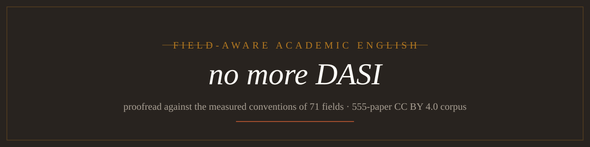

<p align="center">
  
</p>

<p align="center">
  <strong>연구 원고를 위한 분야 맞춤형 학술 영어 교정 —<br>
  지도교수가 “다시해와”라고 말하기 전에 다듬습니다.</strong>
</p>

<p align="center">
  
  <a href="docs/attributions.html"></a>
  <a href="docs/ATTRIBUTIONS.md"></a>
</p>

<!-- README-I18N:START -->

[English](./README.md) | **한국어**

<!-- README-I18N:END -->

**no-more-dasi**(“no more DASI” — DASI는 “다시”의 로마자 표기입니다)는 영어 논문을 *해당 분야의* 관례에 맞게 다듬습니다 — 555편의 CC BY 4.0 논문과 Nature의 71개 주제 분야 코퍼스 실측에 근거해, 직감이 아닌 측정으로. **원고는 어떤 언어로 썼든** 먼저 영어로 번역한 뒤 같은 파이프라인으로 교정합니다. 이는 에이전트 스킬입니다. 코딩/연구 에이전트가 이 스킬을 불러오며, 에이전트가 수행하는 모든 수정은 사용자에게 전달되기 전에 결정론적 검증 게이트를 통과해야 합니다.

[기능](#기능) · [설치](#설치) · [사용법](#사용법) · [동작 방식](#동작-방식) · [검증 게이트](#검증-게이트) · [출처 및 라이선스](#출처-및-라이선스) · [후원](#후원)

## 기능

- **71개 분야 오버레이, 코퍼스 측정 기반.** 각 오버레이에는 해당 분야의 실제 논문에서 추출한 문체 지표, 주요 용어, 구문 뱅크, 표기 점검 목록이 담겨 있습니다(Physics 100편, Optics and photonics 80편 등이며, 코퍼스는 매주 다시 수집됩니다).
- **의미 불변을 입증합니다.** 숫자, 단위, 화학식, 인용, 방정식, DOI는 원문 그대로 유지되어야 하며, 그렇지 않으면 결정론적 게이트가 전달을 차단합니다. 변경률이 30%를 넘으면 경고하고, 50%를 넘으면 중단 후 확인을 요청합니다.
- **LLM의 자기 채점은 없습니다.** 저널 적용 범위, 무결성, 용어, 약어를 검사하는 네 가지 스크립트 게이트가 전달 전에 모두 0으로 종료되어야 합니다. “직접 확인했습니다”는 증거로 인정하지 않습니다.
- **모든 수정에는 기록이 남습니다.** 섹션 단위 저널(`edits.json`)에는 변경된 구간과 검토했지만 유지한 구간이 모두 기록되며, 각각 어떤 규칙이 작동했는지 정확히 연결됩니다. 수정된 원고마다 HTML 무결성 보고서도 함께 제공됩니다.
- **장르를 유지하며 평탄화하지 않습니다.** 학술 문체를 보존합니다. ASD-STE100도, 20단어 문장 제한도, 강제적인 능동태 전환도 적용하지 않습니다. 대상 저널의 자체 측정 통계(수동태 1만 단어당 111~137회, 평균 문장 길이 16.5~18.3)가 이를 뒷받침하기 때문입니다.
- **한국어 저자를 고려합니다.** 전용 함정 방지 계층이 번역투(“~를 통해”, “~에 의해”)가 영어 초안에 들어가기 전에 차단하며, AI 생성 초안에는 별도의 탐지 계층을 적용합니다.
- **수정 예산은 사용자가 정합니다.** 스킬이 light / standard / heavy를 진단하고, 사용자가 low / mid / high 예산을 선택하면 실제 작업량은 둘 중 더 작은 쪽으로 정해집니다. 여러 강도를 한 번에 요청하면 각각 별도의 결과물(`name.low.md`, `name.mid.md`, `name.high.md`)로 제공됩니다.

## 설치

배포 가능한 스킬은 [`skills/nomoredasi/`](skills/nomoredasi/)에 있습니다. 에이전트의 스킬 디렉터리에 연결하세요.

```bash
git clone https://github.com/yelixir-dev/no-more-dasi-eng.git
ln -s "$(pwd)/no-more-dasi-eng/skills/nomoredasi" ~/.agents/skills/nomoredasi
```

사용 중인 하네스에 맞게 `~/.agents/skills`를 조정하세요(예: `~/.claude/skills`). 심볼릭 링크 대신 복사해도 됩니다. skills CLI를 사용한다면 `npx skills add https://github.com/yelixir-dev/no-more-dasi-eng --skill nomoredasi`를 실행하세요. 새 에이전트 세션을 시작하면 스킬의 트리거가 활성화됩니다.

## 사용법

영어나 한국어로 에이전트에게 “proofread this paper for Nature”, “논문 영어 다듬어줘”, “Nature 투고용으로 교정”, “번역투 없애줘”, “AI가 쓴 논문 초안 교정”이라고 요청하면 됩니다. 스킬이 자신을 알리고 작업을 시작합니다.

```text
nomoredasi v0.1 — 유형 B / 분야: Optics and photonics
```

세 가지 결과물을 받습니다. 교정된 원고, 모든 변경과 의도적으로 변경하지 않은 항목을 규칙과 함께 기록한 `<name>.edits.json` 저널, 그리고 차이를 검토할 수 있는 `<name>.integrity-report.html`입니다. 원한다면 “가볍게(low)로”, “mid budget please”처럼 예산을 명시하거나, 한 번에 여러 강도를 요청할 수 있습니다.

## 동작 방식

1. **입력 유형 판별.** 한국어 원고는 번역 + 교정 경로(먼저 함정 방지 계층)를 사용하고, 영어/AI 초안 원고는 교정 경로와 필요할 때 AI 흔적 계층을 사용합니다.
2. **분야 라우팅.** 명시적 지시 → 원고 폴더명 → 71개 오버레이를 대상으로 한 `route_field.py` 자동 감지(점수가 비슷하면 두 오버레이 병합) → 여전히 불명확하면 확인 질문을 정확히 한 번만 합니다. 핵심 규칙은 분야와 무관하므로 잘못된 라우팅도 점진적으로만 품질을 저하시킵니다.
3. **원고 상태 관리.** 선택 사항인 `manuscript.json`(정의된 약어, 고정 표기, 그림 목록)은 세션 간 부분 수정과 반복 수정을 일관되게 유지합니다. 학습된 결정은 다시 기록하며, 조용히 덮어쓰지 않습니다.
4. **섹션 인식 편집.** 원고를 IMRaD 방식으로 나눕니다(Results–Discussion 병합 및 기타 변형도 허용하며, 절대 “정규화”하지 않습니다). Methods는 과거 시제/수동태를 유지하고, Results에는 해석을 넣지 않으며, Discussion은 현재 시제로 분석하고, 결론의 뼈대가 Introduction으로 새어 들어가지 않게 합니다. “서론만”과 같은 부분 요청은 해당 섹션으로 범위를 고정합니다.
5. **검증.** 네 가지 결정론적 게이트를 순서대로 실행합니다(아래 참조).
6. **로깅.** 모든 수정 쌍과 저널을 기록해 코퍼스 벤치와 주간 오버레이 수집 주기에 반영합니다.

## 검증 게이트

| 게이트 | 스크립트 | 다음 경우 전달을 차단합니다 |
|---|---|---|
| 0 · 저널 적용 범위 | `check_journal.py` | 어떤 diff hunk에 저널의 `changed`/`kept` 항목이 없거나, 구간이 40토큰을 초과하거나, 인용된 규칙 ID가 없는 경우 |
| 1 · 무결성 | `verify_integrity.py` | 숫자, 단위, 수식, 인용, 방정식, DOI 또는(`--overlay` 사용 시) 분야 용어가 달라지거나 변경률이 예산을 초과하는 경우 |
| 2 · 용어 | `check_terms.py` | 표기 변형이 일치하지 않는 경우(bandgap과 band gap 등) |
| 3 · 약어 | `check_abbrev.py` | 정의되지 않은 약어가 나타나는 경우(검증되지 않은 약어는 약어 레지스트리에 기록됩니다) |

## 레포지토리 구조

```text
├── skills/nomoredasi/    the distributable skill (SKILL.md · references/ · scripts/ · tests/)
│   ├── references/core/       field-independent rules (tense, articles, register; AI-tell; Korean-author pitfalls)
│   └── references/overlays/   71 field overlays, corpus-measured
├── docs/                 attribution registry — ATTRIBUTIONS.md · attributions.html (human) · attributions.json (SSOT)
├── papers/  scripts/  logs/  corpus mining and quality benches (development workspace)
```

## 출처 및 라이선스

분야 오버레이는 71개 주제 분야에 걸친 **CC BY 4.0 라이선스의 논문 555편**에서 파생되었습니다. 모든 논문과 모든 분야가 담긴 전체 레지스트리는 [`docs/ATTRIBUTIONS.md`](docs/ATTRIBUTIONS.md)에 있으며, 사람이 읽을 수 있는 형태는 [`docs/attributions.html`](docs/attributions.html), 기계 판독 가능한 원본은 [`docs/attributions.json`](docs/attributions.json)에서 확인할 수 있습니다.

원문 논문의 저작권은 각 저자에게 있으며 CC BY 4.0 조건에 따라 사용됩니다. 프로젝트의 소프트웨어 라이선스는 해당 조건을 대체하거나 범위를 좁히거나 재허가하지 않습니다. 레지스트리에 기재된 저자, 저널, 출판사 또는 관련 기관은 이 프로젝트를 보증하지 않습니다.

## 후원

no-more-dasi는 독립적으로 진행되는 작업입니다. 코퍼스 수집, 규칙 정리, 검증 게이트는 [yelixir-dev](https://github.com/yelixir-dev)가 구축하고 유지 관리합니다. 이 도구가 “다시해와”를 한 번 줄여준다면 [GitHub Sponsors](https://github.com/sponsors/yelixir-dev)를 통해 후원할 수 있습니다. 한국의 후원자를 위한 추가 채널(Toss)과 해외 채널(Ko-fi)은 열리는 대로 [.github/FUNDING.yml](.github/FUNDING.yml)에 연결됩니다.

## 현재 한계

- **v0.1, 얼리 액세스.** 코퍼스는 Physics(논문 100편)와 Optics and photonics(80편)에 편중되어 있습니다. 10편 미만의 분야에는 지표가 엄격한 목표가 아니라 방향을 제시하는 지침인 *미성숙* 오버레이가 제공되며, 그런 경우 스킬이 알려줍니다.
- **학술 문체만 지원합니다.** 일반 영어 또는 단순화된 기술 영어 규칙으로 지나치게 단순화하는 작업은 의도적으로 거부합니다.
- **Nature 스타일을 따르는 분야.** 71개 오버레이는 Nature의 주제 분류를 따릅니다. IEEE, ACM처럼 별도의 하우스 스타일을 사용하는 학술지는 현재 분야 독립적인 핵심 규칙을 적용합니다.
- **번역 언어별 커버리지.** 번역투 전용 계층은 현재 한국어 원고에만 적용됩니다. 다른 언어 원고는 언어별 함정 패스 없이 분야 독립 코어 규칙으로 번역·교정됩니다.

## 라이선스

공개 릴리스 전에 프로젝트 라이선스를 이곳에 명시할 예정입니다. 문체 분석에 사용된 제3자 논문 자료는 원 저자와 함께 CC BY 4.0의 적용을 받습니다. 자세한 내용은 [출처 및 라이선스](#출처-및-라이선스)를 참조하세요.

---

<p align="center"><em>no more DASI — 다음 초안이 바로 완성본이 되도록.</em></p>
