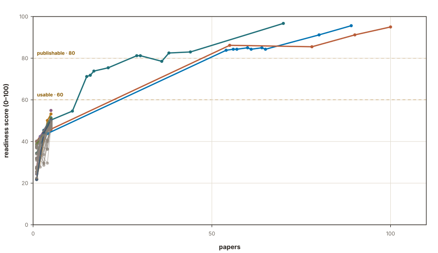

<p align="center">
  
</p>

<p align="center">
  <strong>Field-aware academic English proofreading for research manuscripts —<br>
  refined before your advisor says “do it again.”</strong>
</p>

<p align="center">
  
  <a href="docs/attributions.html"></a>
  <a href="docs/ATTRIBUTIONS.md"></a>
</p>

<!-- README-I18N:START -->

**English** | [한국어](./README.ko.md)

<!-- README-I18N:END -->

<!-- READINESS:START -->
## Field readiness



| Field | Papers | Score |
| --- | ---: | ---: |
| Physics (major) | 100 | 95.0 |
| Optics and photonics (major) | 80 | 91.2 |
| Chemistry (major) | 44 | 83.0 |
| Biophysics (major) | 5 | 54.9 |
| Biotechnology (major) | 5 | 50.6 |
| Microbiology (major) | 5 | 50.2 |
| Cancer (major) | 5 | 49.6 |
| Environmental sciences (major) | 5 | 49.2 |
| Energy science and technology (major) | 5 | 48.9 |
| Biochemistry (major) | 5 | 48.7 |
| Cell biology (major) | 5 | 48.3 |
| Biological techniques (major) | 5 | 48.1 |
| Neuroscience (major) | 5 | 47.8 |
| Materials science (major) | 5 | 47.7 |
| Mathematics and computing (major) | 5 | 47.7 |
| Medical research (major) | 5 | 47.1 |
| Nanoscience and technology (major) | 5 | 47.1 |
| Engineering (major) | 5 | 45.8 |
| Diseases (major) | 5 | 45.7 |
| Health care (major) | 5 | 45.6 |
| Drug discovery (minor) | 5 | 53.2 |
| Forestry (minor) | 5 | 51.4 |
| Oncology (minor) | 5 | 51.0 |
| Gastroenterology (minor) | 5 | 50.4 |
| Structural biology (minor) | 5 | 50.4 |
| Immunology (minor) | 5 | 50.2 |
| Pathogenesis (minor) | 5 | 50.2 |
| Developmental biology (minor) | 5 | 50.0 |
| Climate sciences (minor) | 5 | 49.9 |
| Systems biology (minor) | 5 | 49.9 |
| Geography (minor) | 5 | 49.8 |
| Natural hazards (minor) | 5 | 49.8 |
| Molecular medicine (minor) | 5 | 49.7 |
| Stem cells (minor) | 5 | 49.5 |
| Anatomy (minor) | 5 | 49.4 |
| Environmental social sciences (minor) | 5 | 49.1 |
| Health occupations (minor) | 5 | 49.0 |
| Molecular biology (minor) | 5 | 49.0 |
| Signs and symptoms (minor) | 5 | 49.0 |
| Business and industry (minor) | 5 | 48.9 |
| Agriculture (minor) | 5 | 48.7 |
| Limnology (minor) | 5 | 48.6 |
| Plant sciences (minor) | 5 | 48.6 |
| Space physics (minor) | 5 | 48.6 |
| Planetary science (minor) | 5 | 48.5 |
| Social sciences (minor) | 5 | 48.5 |
| Biogeochemistry (minor) | 5 | 48.3 |
| Genetics (minor) | 5 | 48.2 |
| Developing world (minor) | 5 | 48.1 |
| Ecology (minor) | 5 | 48.0 |
| Risk factors (minor) | 5 | 48.0 |
| Zoology (minor) | 5 | 48.0 |
| Solid Earth sciences (minor) | 5 | 47.9 |
| Astronomy and planetary science (minor) | 5 | 47.8 |
| Biomarkers (minor) | 5 | 47.8 |
| Chemical biology (minor) | 5 | 47.7 |
| Computational biology and bioinformatics (minor) | 5 | 47.6 |
| Energy and society (minor) | 5 | 47.6 |
| Psychology (minor) | 5 | 47.3 |
| Ocean sciences (minor) | 5 | 47.1 |
| Rheumatology (minor) | 5 | 47.1 |
| Cardiology (minor) | 5 | 47.0 |
| Evolution (minor) | 5 | 47.0 |
| Physiology (minor) | 5 | 47.0 |
| Hydrology (minor) | 5 | 46.9 |
| Urology (minor) | 5 | 46.9 |
| Endocrinology (minor) | 5 | 46.8 |
| Scientific community (minor) | 5 | 46.8 |
| Neurology (minor) | 5 | 46.3 |
| Water resources (minor) | 5 | 46.3 |
| Nephrology (minor) | 5 | 45.6 |

_auto-updated by the delta cycle._
<!-- READINESS:END -->

**no-more-dasi** (“no more DASI” — 다시 [DASI] is Korean for “do it again”) polishes English research manuscripts to the conventions of *your field* — measured, not intuited, from a live corpus of 555 CC BY 4.0 papers across Nature's 71 subject categories. **Write your draft in any language**: it is translated into English first, then edited through the same pipeline. It is an agent skill: your coding/research agent loads it, and every edit it makes must pass deterministic verification gates before anything reaches you.

[What it does](#what-it-does) · [Install](#install) · [Usage](#usage) · [How it works](#how-it-works) · [Verification gates](#verification-gates) · [Attribution](#attribution) · [Sponsoring](#sponsoring)

## What it does

- **71 field overlays, corpus-measured.** Each overlay carries style metrics, top terms, a phrase bank, and a notation watch list mined from real papers in that field (Physics 100 papers, Optics and photonics 80, and growing — the corpus re-mines on a weekly cycle).
- **Meaning invariant, provably.** Numbers, units, chemical formulas, citations, equations, and DOIs must survive verbatim; a deterministic gate blocks delivery otherwise. Change rate past 30% warns, past 50% halts and asks.
- **No LLM self-grading.** Four script gates — journal coverage, integrity, terminology, abbreviations — must exit 0 before delivery. “I checked it myself” is not accepted as evidence.
- **Every edit leaves a receipt.** A section-level journal (`edits.json`) records both changed spans and evaluated-but-kept spans, each tied to the exact rule that fired, and an HTML integrity report ships with every edited manuscript.
- **Genre kept, not flattened.** Academic register is preserved. No ASD-STE100, no 20-word sentence caps, no forced active voice — because the target journals' own measured statistics (passives 111–137 per 10K words, mean sentence length 16.5–18.3) say so.
- **Korean-author aware.** A dedicated pitfalls layer blocks translationese (“~를 통해”, “~에 의해”) before it reaches the English draft; AI-generated drafts get their own detection layer.
- **You set the edit budget.** The skill diagnoses light / standard / heavy, you choose a low / mid / high budget, and the effective workload is the minimum of the two. Ask for several intensities at once and each arrives as a separate deliverable (`name.low.md`, `name.mid.md`, `name.high.md`).

## Install

The distributable skill lives in [`skills/nomoredasi/`](skills/nomoredasi/). Link it into your agent's skills directory:

```bash
git clone https://github.com/yelixir-dev/no-more-dasi-eng.git
ln -s "$(pwd)/no-more-dasi-eng/skills/nomoredasi" ~/.agents/skills/nomoredasi
```

Adapt `~/.agents/skills` to your harness (e.g. `~/.claude/skills`); a plain copy instead of a symlink works too. If you use the skills CLI: `npx skills add https://github.com/yelixir-dev/no-more-dasi-eng --skill nomoredasi`. Start a new agent session and the skill's triggers are live.

## Usage

Just ask your agent, in English or Korean — “proofread this paper for Nature”, “논문 영어 다듬어줘”, “Nature 투고용으로 교정”, “번역투 없애줘”, “AI가 쓴 논문 초안 교정”. The skill announces itself and gets to work:

```text
nomoredasi v0.1 — 유형 B / 분야: Optics and photonics
```

You receive three things: the corrected manuscript, a `<name>.edits.json` journal (every change and every deliberate non-change, rule-cited), and a `<name>.integrity-report.html` you can diff-review. Set the budget explicitly if you want — “가볍게(low)로”, “mid budget please” — or request several intensities in one go.

## How it works

1. **Input typing.** Korean manuscript (translate + edit path, pitfalls layer first) or English / AI-draft manuscript (edit path, AI-tell layer when indicated).
2. **Field routing.** Your explicit instruction → manuscript folder name → `route_field.py` auto-detection over the 71 overlays (merges two overlays when scores are close) → exactly one closed confirmation question if still unclear. Core rules are field-independent, so a wrong route degrades gracefully.
3. **Manuscript state.** An optional `manuscript.json` (defined abbreviations, fixed notations, figure list) keeps partial and repeated edits consistent across sessions; learned decisions are written back, never silently overwritten.
4. **Section-aware editing.** The manuscript is split IMRaD-style (merged Results–Discussion and other variants tolerated, never “normalized”). Methods stay past/passive, Results keep interpretation out, Discussion analyzes in present tense, and no conclusion scaffolding leaks into the Introduction. Partial requests (“서론만”) are scope-locked to that section.
5. **Verification.** Four deterministic gates, in order (see below).
6. **Logging.** Every edit pair and journal is logged to feed corpus benches and the weekly overlay mining cycle.

## Verification gates

| Gate | Script | Blocks delivery when |
|---|---|---|
| 0 · Journal coverage | `check_journal.py` | any diff hunk lacks a journaled `changed`/`kept` entry, spans exceed 40 tokens, or a cited rule id is missing |
| 1 · Integrity | `verify_integrity.py` | numbers, units, formulas, citations, equations, DOIs, or (with `--overlay`) field terms drift — or the change rate exceeds the budget |
| 2 · Terminology | `check_terms.py` | notation variants disagree (bandgap vs. band gap) |
| 3 · Abbreviations | `check_abbrev.py` | an undefined abbreviation appears (unverified ones are recorded to the abbreviation registry) |

## Repository layout

```text
├── skills/nomoredasi/    the distributable skill (SKILL.md · references/ · scripts/ · tests/)
│   ├── references/core/       field-independent rules (tense, articles, register; AI-tell; Korean-author pitfalls)
│   └── references/overlays/   71 field overlays, corpus-measured
├── docs/                 attribution registry — ATTRIBUTIONS.md · attributions.html (human) · attributions.json (SSOT)
├── papers/  scripts/  logs/  corpus mining and quality benches (development workspace)
```

## Attribution

The field overlays are derived from **555 articles licensed CC BY 4.0** across 71 subject fields. The full registry — every paper, every field — lives in [`docs/ATTRIBUTIONS.md`](docs/ATTRIBUTIONS.md), with a human-readable view in [`docs/attributions.html`](docs/attributions.html) and the machine-readable source of truth in [`docs/attributions.json`](docs/attributions.json).

Source articles remain the copyright of their authors and are used under the terms of CC BY 4.0; the project's software license does not replace, narrow, or relicense those terms. No author, journal, publisher, or affiliated institution listed in the registry endorses this project.

## Sponsoring

no-more-dasi is independent work — corpus mining, rule distillation, and the verification gates are built and maintained by [yelixir-dev](https://github.com/yelixir-dev). If it saves you a round of “do it again”, you can support it through [GitHub Sponsors](https://github.com/sponsors/yelixir-dev). Additional channels for supporters in Korea (Toss) and abroad (Ko-fi) will be added here as they open.

## Current limitations

- **v0.1, early access.** The corpus skews to Physics (100 papers) and Optics and photonics (80); fields with fewer than 10 papers ship *immature* overlays whose metrics are directional guidance, not hard targets — the skill tells you when that is the case.
- **Academic register only.** It deliberately refuses to oversimplify into plain English or simplified-technical-English rule sets.
- **Nature-flavored fields.** The 71 overlays follow Nature's subject categories; venues with different house styles (IEEE, ACM) currently ride the field-independent core rules.
- **Translation coverage by source language.** The dedicated anti-translationese pitfalls layer currently covers Korean source drafts; other languages are translated and edited under the field-independent core rules, without a language-specific pitfalls pass.

## License

The project license will be declared here before the public release. Third-party article material used for style analysis remains under CC BY 4.0 with its original authors — see [Attribution](#attribution).

---

<p align="center"><em>no more DASI — so the next draft is the one.</em></p>
